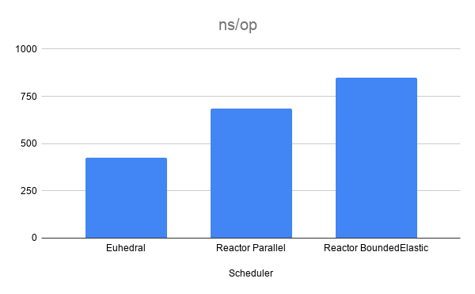
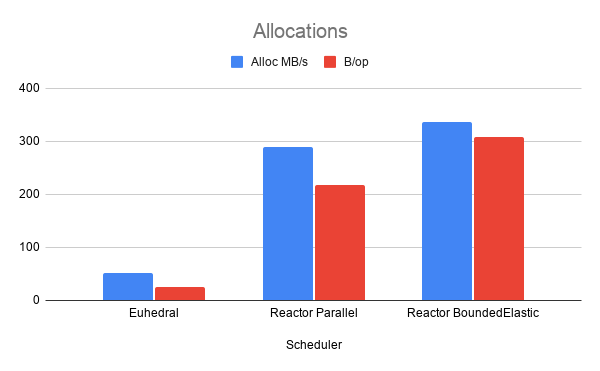

# Benchmarks in Amazon ECS using Graviton4

| Config            | Value            |
|:------------------|:-----------------|
| Instance          | AWS c8g.8xlarge  |
| Operating System  | Amazon Linux     |
| Processor         | AWS Graviton4    |
| Architecture      | arm64            |
| vCPUs             | 32               |

#### VM Flags

```
-XX:+UseThreadPriorities
--enable-native-access=ALL-UNNAMED
--sun-misc-unsafe-memory-access=allow
--add-exports java.base/jdk.internal.platform=ALL-UNNAMED
--add-exports java.base/jdk.internal.vm.annotation=ALL-UNNAMED
--add-opens java.base/java.util=ALL-UNNAMED
```

Work items were pre-allocated for all benchmarks to only measure scheduling overhead.

JMH was used for all benchmarking.

---

# Mandelbrot Results

A deliberately chaotic workload

Rendered an 8K [Mandelbrot set](https://en.wikipedia.org/wiki/Mandelbrot_set) using:

- 2X SSAA
- 5,000 max iterations
- randomized pixel ordering

This benchmark intentionally destroys locality and creates highly irregular execution behavior.

Total tasks: 132,710,400




| Scheduler              |   ns/op | Alloc mb/sec | bytes/op | GC Counts | GC Time |
|:-----------------------|--------:|-------------:|---------:|----------:|--------:|
| Euhedral Core          | 427.371 |       51.439 |   24.828 |         1 |       8 |
| Reactor Parallel       | 686.709 |      289.979 |  216.795 |        10 |      51 |
| Reactor BoundedElastic | 849.406 |      335.748 |  308.370 |        15 |      46 |

---

#### Perf Counter Comparison

| Scheduler              | IPC  | L1 D-Cache Miss | L1 I-Cache Miss | dTLB Miss | iTLB Miss % |
|------------------------|------|----------------:|----------------:|----------:|------------:|
| Euhedral Core          | 2.70 |           14.0% |            1.0% |     11.0% |        0.0% |
| Reactor Parallel       | 2.79 |           48.0% |           70.0% |     46.0% |       42.0% |
| Reactor BoundedElastic | 2.70 |           54.0% |           96.0% |     61.0% |       66.0% |

---

#### Raw Hardware Counters

| Scheduler              |             Cycles |       Instructions |   Cache Misses | Branch Misses |
|------------------------|-------------------:|-------------------:|---------------:|--------------:|
| Euhedral Core          | 10,872,009,349,780 | 29,317,545,740,902 |  6,961,449,897 |   720,708,421 |
| Reactor Parallel       |  8,280,163,748,645 | 23,071,084,397,328 | 15,817,366,762 | 1,581,461,569 |
| Reactor BoundedElastic |  8,594,152,848,058 | 23,246,090,474,919 | 18,939,726,070 | 1,910,856,547 |

---

#### CPU Time

| Runtime                | Wall Clock Runtime | User Seconds | System Time |
|------------------------|-------------------:|-------------:|------------:|
| Euhedral Core          |            123.748 |     4227.275 |       8.474 |
| Reactor Parallel       |            181.239 |     3204.007 |     798.324 |
| Reactor BoundedElastic |            224.723 |     3372.097 |    1261.851 |

---

# Throughput

32 million no-op frames per invocation utilizing all cores.

---

#### Throughput

| Scheduler     | ops/ns |    ops/sec | Avg ns/op |
|---------------|-------:|-----------:|----------:|
| Euhedral Core |  0.025 | 25,000,000 |    32.653 |

---

#### Throughput Latency Percentiles ns/op

| Scheduler     | p0 | p50 | p90 |  p95 | p99 | p999 | p9999 | p100 |
|---------------|---:|----:|----:|-----:|----:|-----:|------:|-----:|
| Euhedral Core | 31 |  32 |  34 | 35.5 |  43 |   43 |    43 |   43 |

---

#### Allocations

| Scheduler     | Alloc mb/sec | bytes/op | GC Count | GC Time ms |
|---------------|-------------:|---------:|---------:|-----------:|
| Euhedral Core |       55.244 |    2.312 |        4 |          8 |

---

# End-to-End Latency

Each invocation executes **100K** no-op frames.

---

#### Average Latency

| Scheduler     | Avg ns/op |
|---------------|----------:|
| Euhedral Core |   301.584 |

---

#### Percentiles

| Scheduler     |  p0 | p50 | p90 | p95 | p99 | p999 | p9999 | p100 |
|---------------|----:|----:|----:|----:|----:|-----:|------:|-----:|
| Euhedral Core | 282 | 309 | 312 | 313 | 315 |  324 |   378 |  378 |

---

#### Allocations

| Scheduler     | Alloc mb/sec | bytes/op | GC Count | GC Time ms |
|---------------|-------------:|---------:|---------:|-----------:|
| Euhedral Core |        1.234 |    0.411 |        0 |          0 |

---

# Raw Data

---

## Mandelbrot

---

### Results

```
Benchmark                                                                                Mode  Cnt    Score   Error   Units
MandelbrotBenchmark.EuhedralMandelbrot.render                                            avgt       427.371           ns/op
MandelbrotBenchmark.EuhedralMandelbrot.render:gc.alloc.rate                              avgt        51.439          MB/sec
MandelbrotBenchmark.EuhedralMandelbrot.render:gc.alloc.rate.norm                         avgt        24.828            B/op
MandelbrotBenchmark.EuhedralMandelbrot.render:gc.count                                   avgt         1.000          counts
MandelbrotBenchmark.EuhedralMandelbrot.render:gc.time                                    avgt         8.000              ms
MandelbrotBenchmark.ReactorMandelbrot.renderSchedulersBoundedElastic                     avgt       849.406           ns/op
MandelbrotBenchmark.ReactorMandelbrot.renderSchedulersBoundedElastic:gc.alloc.rate       avgt       335.748          MB/sec
MandelbrotBenchmark.ReactorMandelbrot.renderSchedulersBoundedElastic:gc.alloc.rate.norm  avgt       308.370            B/op
MandelbrotBenchmark.ReactorMandelbrot.renderSchedulersBoundedElastic:gc.count            avgt        15.000          counts
MandelbrotBenchmark.ReactorMandelbrot.renderSchedulersBoundedElastic:gc.time             avgt        46.000              ms
MandelbrotBenchmark.ReactorMandelbrot.renderSchedulersBoundedElastic:perf                avgt           NaN             ---
MandelbrotBenchmark.ReactorMandelbrot.renderSchedulersParallel                           avgt       686.709           ns/op
MandelbrotBenchmark.ReactorMandelbrot.renderSchedulersParallel:gc.alloc.rate             avgt       289.979          MB/sec
MandelbrotBenchmark.ReactorMandelbrot.renderSchedulersParallel:gc.alloc.rate.norm        avgt       216.795            B/op
MandelbrotBenchmark.ReactorMandelbrot.renderSchedulersParallel:gc.count                  avgt        10.000          counts
MandelbrotBenchmark.ReactorMandelbrot.renderSchedulersParallel:gc.time                   avgt        51.000              ms
```

---

### Euhedral Perf

```
Perf stats:
--------------------------------------------------

    10872009349780      cycles                                                               (15.80%)
    29317545740902      instructions                     #    2.70  insn per cycle           (15.81%)
        6961449897      cache-misses                                                         (15.83%)
     5051334981384      L1-dcache-loads                                                      (10.55%)
        7083732659      L1-dcache-load-misses            #    0.14% of all L1-dcache accesses  (10.56%)
     4591227341839      L1-icache-loads                                                      (10.55%)
         329639803      L1-icache-load-misses            #    0.01% of all L1-icache accesses  (10.54%)
     5045581966070      dTLB-loads                                                           (10.54%)
        5556175870      dTLB-load-misses                 #    0.11% of all dTLB cache accesses  (10.54%)
     5545192165615      branch-loads                                                         (10.54%)
         720708421      branch-misses                                                        (10.54%)
     5047670567742      L1-dcache-loads                                                      (10.53%)
        6939646587      L1-dcache-load-misses            #    0.14% of all L1-dcache accesses  (10.54%)
     4589611995826      L1-icache-loads                                                      (10.54%)
         391621052      L1-icache-load-misses            #    0.01% of all L1-icache accesses  (10.53%)
     5046679353894      dTLB-loads                                                           (10.53%)
        5558123572      dTLB-load-misses                 #    0.11% of all dTLB cache accesses  (10.53%)
     2137922979906      iTLB-loads                                                           (10.53%)
          27585986      iTLB-load-misses                 #    0.00% of all iTLB cache accesses  (10.53%)

     123.748237492 seconds time elapsed

    4227.274761000 seconds user
       8.474339000 seconds sys
```

---

### Reactor Parallel Perf

```
Perf stats:
--------------------------------------------------

     8280163748645      cycles                                                               (15.75%)
    23071084397328      instructions                     #    2.79  insn per cycle           (15.73%)
       15817366762      cache-misses                                                         (15.77%)
     3382234622990      L1-dcache-loads                                                      (10.54%)
       16030183574      L1-dcache-load-misses            #    0.48% of all L1-dcache accesses  (10.55%)
     3657700605550      L1-icache-loads                                                      (10.54%)
       25615631548      L1-icache-load-misses            #    0.70% of all L1-icache accesses  (10.52%)
     3375317593462      dTLB-loads                                                           (10.59%)
       15588725479      dTLB-load-misses                 #    0.46% of all dTLB cache accesses  (10.59%)
     4511128982422      branch-loads                                                         (10.55%)
        1581461569      branch-misses                                                        (10.53%)
     3358670956943      L1-dcache-loads                                                      (10.51%)
       15968170480      L1-dcache-load-misses            #    0.47% of all L1-dcache accesses  (10.54%)
     3652048186325      L1-icache-loads                                                      (10.54%)
       25625013170      L1-icache-load-misses            #    0.70% of all L1-icache accesses  (10.54%)
     3356729730407      dTLB-loads                                                           (10.57%)
       15519568828      dTLB-load-misses                 #    0.46% of all dTLB cache accesses  (10.59%)
      520383308155      iTLB-loads                                                           (10.56%)
        2184410144      iTLB-load-misses                 #    0.42% of all iTLB cache accesses  (10.50%)

     181.238902440 seconds time elapsed

    3204.007458000 seconds user
     798.324027000 seconds sys
```

---

### Reactor Bounded Elastic Perf

```
Perf stats:
--------------------------------------------------

     8594152848058      cycles                                                               (15.85%)
    23246090474919      instructions                     #    2.70  insn per cycle           (15.86%)
       18939726070      cache-misses                                                         (15.89%)
     3529260871970      L1-dcache-loads                                                      (10.57%)
       19029523698      L1-dcache-load-misses            #    0.54% of all L1-dcache accesses  (10.56%)
     3788158921265      L1-icache-loads                                                      (10.58%)
       36369990442      L1-icache-load-misses            #    0.96% of all L1-icache accesses  (10.55%)
     3539292492720      dTLB-loads                                                           (10.49%)
       21387548084      dTLB-load-misses                 #    0.61% of all dTLB cache accesses  (10.52%)
     4659490766446      branch-loads                                                         (10.52%)
        1910856547      branch-misses                                                        (10.52%)
     3538801799794      L1-dcache-loads                                                      (10.55%)
       19048602725      L1-dcache-load-misses            #    0.54% of all L1-dcache accesses  (10.51%)
     3793451929743      L1-icache-loads                                                      (10.49%)
       36380861486      L1-icache-load-misses            #    0.96% of all L1-icache accesses  (10.49%)
     3529332442682      dTLB-loads                                                           (10.47%)
       21603712380      dTLB-load-misses                 #    0.61% of all dTLB cache accesses  (10.51%)
      685134286052      iTLB-loads                                                           (10.56%)
        4549219927      iTLB-load-misses                 #    0.66% of all iTLB cache accesses  (10.56%)

     224.722696817 seconds time elapsed

    3372.097428000 seconds user
    1261.851341000 seconds sys
```

---

## Throughput

Running on all cores

```
Benchmark                                                              Mode  Cnt   Score    Error   Units
TrueThroughputBenchmark.ingest32million32sources                      thrpt    5   0.025 ±  0.004  ops/ns
TrueThroughputBenchmark.ingest32million32sources:gc.alloc.rate        thrpt    5  55.244 ± 14.538  MB/sec
TrueThroughputBenchmark.ingest32million32sources:gc.alloc.rate.norm   thrpt    5   2.312 ±  0.973    B/op
TrueThroughputBenchmark.ingest32million32sources:gc.count             thrpt    5   4.000           counts
TrueThroughputBenchmark.ingest32million32sources:gc.time              thrpt    5   8.000               ms
TrueThroughputBenchmark.ingest32million32sources                     sample   49  32.653 ±  0.929   ns/op
TrueThroughputBenchmark.ingest32million32sources:gc.alloc.rate       sample    5  37.710 ± 11.092  MB/sec
TrueThroughputBenchmark.ingest32million32sources:gc.alloc.rate.norm  sample    5   1.317 ±  0.505    B/op
TrueThroughputBenchmark.ingest32million32sources:gc.count            sample    5   3.000           counts
TrueThroughputBenchmark.ingest32million32sources:gc.time             sample    5   9.000               ms
TrueThroughputBenchmark.ingest32million32sources:p0.00               sample       31.000            ns/op
TrueThroughputBenchmark.ingest32million32sources:p0.50               sample       32.000            ns/op
TrueThroughputBenchmark.ingest32million32sources:p0.90               sample       34.000            ns/op
TrueThroughputBenchmark.ingest32million32sources:p0.95               sample       35.500            ns/op
TrueThroughputBenchmark.ingest32million32sources:p0.99               sample       43.000            ns/op
TrueThroughputBenchmark.ingest32million32sources:p0.999              sample       43.000            ns/op
TrueThroughputBenchmark.ingest32million32sources:p0.9999             sample       43.000            ns/op
TrueThroughputBenchmark.ingest32million32sources:p1.00               sample       43.000            ns/op
```

```
Perf stats:
--------------------------------------------------

     4860023507098      cycles                                                               (15.80%)
     5529247429985      instructions                     #    1.14  insn per cycle           (15.83%)
       73726893375      cache-misses                                                         (15.85%)
     1922286844427      L1-dcache-loads                                                      (10.56%)
       73686182475      L1-dcache-load-misses            #    3.84% of all L1-dcache accesses  (10.56%)
      885686465228      L1-icache-loads                                                      (10.56%)
         179794964      L1-icache-load-misses            #    0.02% of all L1-icache accesses  (10.56%)
     1913194722665      dTLB-loads                                                           (10.55%)
      112934812503      dTLB-load-misses                 #    5.91% of all dTLB cache accesses  (10.56%)
      999112658656      branch-loads                                                         (10.56%)
         389666734      branch-misses                                                        (10.55%)
     1919394841012      L1-dcache-loads                                                      (10.55%)
       73632567590      L1-dcache-load-misses            #    3.83% of all L1-dcache accesses  (10.54%)
      875745886310      L1-icache-loads                                                      (10.54%)
         181762212      L1-icache-load-misses            #    0.02% of all L1-icache accesses  (10.54%)
     1905523454966      dTLB-loads                                                           (10.53%)
      114097506856      dTLB-load-misses                 #    5.98% of all dTLB cache accesses  (10.53%)
     1164695806959      iTLB-loads                                                           (10.53%)
          17873056      iTLB-load-misses                 #    0.00% of all iTLB cache accesses  (10.52%)

      55.112402283 seconds time elapsed

    2685.974259000 seconds user
       5.609988000 seconds sys
```

---

## End-to-End Latency

Running on 1 core

```
Benchmark                                                     Mode   Cnt    Score   Error   Units
EndToEndLatencyBenchmark.ECore.endToEnd                     sample  4758  301.584 ± 0.563   ns/op
EndToEndLatencyBenchmark.ECore.endToEnd:gc.alloc.rate       sample    15    1.234 ± 0.007  MB/sec
EndToEndLatencyBenchmark.ECore.endToEnd:gc.alloc.rate.norm  sample    15    0.411 ± 0.016    B/op
EndToEndLatencyBenchmark.ECore.endToEnd:gc.count            sample    15      ≈ 0          counts
EndToEndLatencyBenchmark.ECore.endToEnd:p0.00               sample        282.000           ns/op
EndToEndLatencyBenchmark.ECore.endToEnd:p0.50               sample        309.000           ns/op
EndToEndLatencyBenchmark.ECore.endToEnd:p0.90               sample        312.000           ns/op
EndToEndLatencyBenchmark.ECore.endToEnd:p0.95               sample        313.000           ns/op
EndToEndLatencyBenchmark.ECore.endToEnd:p0.99               sample        315.000           ns/op
EndToEndLatencyBenchmark.ECore.endToEnd:p0.999              sample        324.000           ns/op
EndToEndLatencyBenchmark.ECore.endToEnd:p0.9999             sample        378.000           ns/op
EndToEndLatencyBenchmark.ECore.endToEnd:p1.00               sample        378.000           ns/op
```

```
Perf stats:
--------------------------------------------------

      275621938430      cycles                                                               (15.88%)
      901714714659      instructions                     #    3.27  insn per cycle           (15.92%)
        1190284012      cache-misses                                                         (15.97%)
      184100078119      L1-dcache-loads                                                      (10.63%)
        1172170266      L1-dcache-load-misses            #    0.64% of all L1-dcache accesses  (10.59%)
      125511505082      L1-icache-loads                                                      (10.57%)
          26127669      L1-icache-load-misses            #    0.02% of all L1-icache accesses  (10.57%)
      184271752314      dTLB-loads                                                           (10.55%)
        8254853172      dTLB-load-misses                 #    4.48% of all dTLB cache accesses  (10.57%)
      143874463383      branch-loads                                                         (10.57%)
          74531240      branch-misses                                                        (10.56%)
      184568336811      L1-dcache-loads                                                      (10.54%)
        1169072211      L1-dcache-load-misses            #    0.63% of all L1-dcache accesses  (10.54%)
      125468209019      L1-icache-loads                                                      (10.53%)
          20292379      L1-icache-load-misses            #    0.02% of all L1-icache accesses  (10.54%)
      184049215737      dTLB-loads                                                           (10.52%)
        8314875487      dTLB-load-misses                 #    4.52% of all dTLB cache accesses  (10.50%)
       36023743828      iTLB-loads                                                           (10.51%)
           1549957      iTLB-load-misses                 #    0.00% of all iTLB cache accesses  (10.54%)

      49.704704123 seconds time elapsed

     131.599489000 seconds user
       0.723623000 seconds sys
```