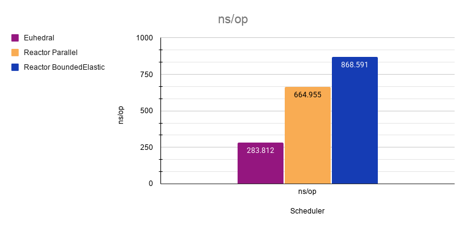
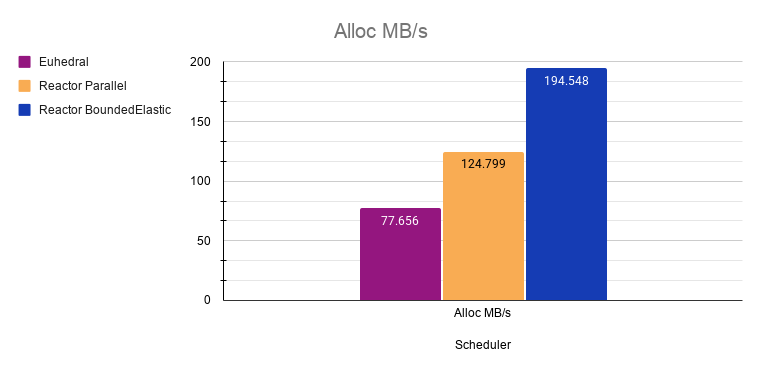
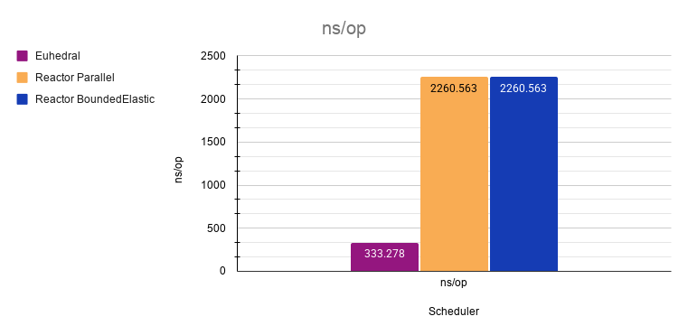
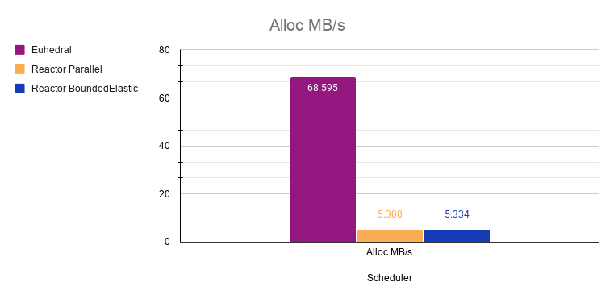

# Benchmarks in Amazon ECS using Graviton4

| Config           | Value           |
|:-----------------|:----------------|
| Instance         | AWS c9g.8xlarge |
| Operating System | Amazon Linux    |
| Processor        | AWS Graviton5   |
| Architecture     | arm64           |
| vCPUs            | 32              |

#### VM Flags

```
-XX:+UseThreadPriorities
--enable-native-access=ALL-UNNAMED
--sun-misc-unsafe-memory-access=allow
--add-exports java.base/jdk.internal.platform=ALL-UNNAMED
--add-exports java.base/jdk.internal.vm.annotation=ALL-UNNAMED
--add-opens java.base/java.util=ALL-UNNAMED
```

Work items were pre-allocated for all benchmarks to only measure scheduling overhead.

JMH was used for all benchmarking.

---

# TOC

<!-- TOC -->

* [Mandelbrot](#mandelbrot)
    * [Disclaimer](#disclaimer)
    * [Mandelbrot (1-by-1)](#mandelbrot-1-by-1)
        * [Results](#results)
            * [Perf Counter Comparison](#perf-counter-comparison)
            * [Raw Hardware Counters](#raw-hardware-counters)
            * [CPU Time](#cpu-time)
    * [Batched Mandelbrot](#batched-mandelbrot)
        * [Results](#results-1)
            * [Perf Counter Comparison](#perf-counter-comparison-1)
            * [Raw Hardware Counters](#raw-hardware-counters-1)
            * [CPU Time](#cpu-time-1)
* [Throughput](#throughput)
    * [Results](#results-2)
    * [Latency Percentiles (ns/op)](#latency-percentiles-nsop)
    * [Allocations](#allocations)
* [End-to-End Latency](#end-to-end-latency)
    * [Results](#results-3)
    * [Percentiles (ns/op)](#percentiles-nsop)
    * [Allocations](#allocations-1)
* [Raw Data](#raw-data)
    * [Mandelbrot (1-by-1)](#mandelbrot-1-by-1-1)
        * [Results](#results-4)
        * [Euhedral Perf](#euhedral-perf)
        * [Reactor Parallel Perf](#reactor-parallel-perf)
        * [Reactor Bounded Elastic Perf](#reactor-bounded-elastic-perf)
    * [Batched Mandelbrot](#batched-mandelbrot-1)
        * [Results](#results-5)
        * [Euhedral Perf](#euhedral-perf-1)
        * [Reactor Parallel Perf](#reactor-parallel-perf-1)
        * [Reactor Bounded Elastic Perf](#reactor-bounded-elastic-perf-1)
    * [Throughput](#throughput-1)
    * [End-to-End Latency](#end-to-end-latency-1)

<!-- TOC -->

---

# Mandelbrot

A deliberately chaotic workload. These benchmarks test performance under highly irregular execution
times. The pixel order is randomized using the same seed for all benchmark runs.

Mission:

Render an 8K [Mandelbrot set](https://en.wikipedia.org/wiki/Mandelbrot_set)

Using:

- 2X SSAA
- An iteration cap of 5,000 per pixel
- Randomized pixel ordering

Total operations: 132,710,400

---

### Disclaimer

Feeding the Reactor schedulers the exact same way as Euhedral does not make them fully utilize the
available cores automatically.

Ideally, they would be fed like this:

```java
Flux.fromArray(this.pixels)
    .parallel()
    .runOn(Schedulers.parallel())
    .subscribe(this.subscriber);

Flux.fromArray(this.pixels)
    .parallel()
    .runOn(Schedulers.boundedElastic())
    .subscribe(this.subscriber);

// Euhedral Core
Flux.fromArray(this.pixels).subscribe(this.subscriber);
this.controlPlane.ingest(this.subscriber);
```

Using `.parallel()` lead to higher allocations, significantly lower throughput, and latencies
exceeding 2 microseconds per operation.

To have a fairer comparison, Reactor needs to be forced into using all cores with flatMap and their
native tasking constructs (Mono). To avoid extra allocations for Reactor, the Mono objects were also
pre-allocated.

How Reactor was fed the tasks:

```java
Flux.fromArray(this.monos)
    .flatMap(m ->m.subscribeOn(Schedulers.parallel()), Runtime.getRuntime().availableProcessors())
    .subscribe(this.subscriber);
```

---

## Mandelbrot (1-by-1)

Pixels are ingested one at a time. This is to simulate a singular heavy stream of irregular work.

This benchmark intentionally destroys locality and creates highly irregular memory access and
execution behavior. It also causes massive contention because 1 source is being accessed by 32
cores.

**Total tasks: 132,710,400**

---

### Results




| Scheduler              |   ns/op | Alloc mb/sec | bytes/op | GC Counts | GC Time |
|:-----------------------|--------:|-------------:|---------:|----------:|--------:|
| Euhedral Core          | 283.812 |       77.656 |   24.035 |         5 |      19 |
| Reactor Parallel       | 664.955 |      124.799 |   87.017 |         6 |      14 |
| Reactor BoundedElastic | 868.591 |      194.548 |  177.191 |         9 |      18 |

---

#### Perf Counter Comparison

| Scheduler              | IPC  | L1 D-Cache Miss | L1 I-Cache Miss | dTLB Miss | iTLB Miss % | Branch Miss % |
|------------------------|------|----------------:|----------------:|----------:|------------:|--------------:|
| Euhedral Core          | 2.92 |           0.05% |           0.02% |     0.03% |       0.00% |     0.000102% |
| Reactor Parallel       | 2.82 |           0.47% |           0.52% |     0.24% |       0.06% |     0.000291% |
| Reactor BoundedElastic | 2.79 |           0.63% |           0.72% |     0.33% |       0.10% |     0.000436% |

---

#### Raw Hardware Counters

| Scheduler              |             Cycles |       Instructions |   Cache Misses |      Branch Loads | Branch Misses |
|------------------------|-------------------:|-------------------:|---------------:|------------------:|--------------:|
| Euhedral Core          | 11,130,922,893,025 | 32,479,411,801,407 |  2,225,993,935 | 6,236,768,652,083 |   633,301,423 |
| Reactor Parallel       |  8,011,251,233,288 | 22,614,170,852,422 | 14,993,849,584 | 4,407,051,354,077 | 1,283,987,696 |
| Reactor BoundedElastic |  7,959,340,583,294 | 22,176,155,589,759 | 21,270,349,800 | 4,556,484,617,144 | 1,987,694,382 |

---

#### CPU Time

| Runtime                | Wall Clock Runtime | User Seconds | System Time |
|------------------------|-------------------:|-------------:|------------:|
| Euhedral Core          |            110.690 |         3630 |          75 |
| Reactor Parallel       |            168.379 |         2726 |        1423 |
| Reactor BoundedElastic |            219.246 |         2860 |        2609 |

---

## Batched Mandelbrot

Pixels are ingested in sub-arrays of 1024. This significantly reduces the number of work items while
increasing the density of them. This is to test execution efficiency and the ability to fan work
out. Because the pixel order is randomized, the chunks of 1024 have relatively uniform execution
time.

**Work Items: 32,400**

**Pixels: 33,177,600**

**Total operations: 132,710,400**

---

### Results




| Scheduler              |    ns/op | Alloc mb/sec | bytes/op | GC Counts | GC Time |
|:-----------------------|---------:|-------------:|---------:|----------:|--------:|
| Euhedral Core          |  333.278 |       68.595 |   24.021 |         1 |       4 |
| Reactor Parallel       | 2260.563 |        5.308 |   12.582 |         4 |      18 |
| Reactor BoundedElastic | 2260.563 |        5.334 |   12.644 |         3 |       7 |

---

#### Perf Counter Comparison

| Scheduler              | IPC  | L1 D-Cache Miss | L1 I-Cache Miss | dTLB Miss | iTLB Miss % | Branch Miss % |
|------------------------|------|----------------:|----------------:|----------:|------------:|--------------:|
| Euhedral Core          | 2.91 |           0.05% |           0.10% |     0.03% |       0.01% |     0.000115% |
| Reactor Parallel       | 2.29 |           0.03% |           0.00% |     0.01% |       0.00% |     0.000296% |
| Reactor BoundedElastic | 2.30 |           0.03% |           0.01% |     0.01% |       0.00% |     0.000299% |

---

#### Raw Hardware Counters

| Scheduler              |            Cycles |       Instructions |  Cache Misses |      Branch Loads | Branch Misses |
|------------------------|------------------:|-------------------:|--------------:|------------------:|--------------:|
| Euhedral Core          | 7,107,328,150,610 | 20,710,163,173,819 | 1,458,884,193 | 3,970,345,393,377 |   457,737,387 |
| Reactor Parallel       | 4,877,537,924,722 | 11,189,795,111,439 |   622,401,498 | 2,030,715,134,267 |   600,430,908 |
| Reactor BoundedElastic | 4,889,719,144,445 | 11,243,845,827,464 |   596,484,125 | 2,034,718,702,391 |   607,760,308 |

---

#### CPU Time

| Runtime                | Wall Clock Runtime | User Seconds | System Time |
|------------------------|-------------------:|-------------:|------------:|
| Euhedral Core          |                 82 |         2425 |         266 |
| Reactor Parallel       |                593 |         1507 |          21 |
| Reactor BoundedElastic |                593 |         1506 |          23 |

---

# Throughput

32 million pre-allocated no-op frames per invocation utilizing all cores.

---

#### Results

| Scheduler     | ops/ns |     ops/sec | Avg ns/op |
|---------------|-------:|------------:|----------:|
| Euhedral Core |  0.140 | 140,000,000 |     7.009 |

---

#### Latency Percentiles (ns/op)

These are the average amortized latencies.

| Scheduler     | p0 | p50 | p90 | p95 |  p99 | p999 | p9999 | p100 |
|---------------|---:|----:|----:|----:|-----:|-----:|------:|-----:|
| Euhedral Core |  7 |   7 |   7 |   7 | 7.89 |    8 |     8 |    8 |

---

#### Allocations

| Scheduler     | Alloc mb/sec | bytes/op | GC Count | GC Time ms |
|---------------|-------------:|---------:|---------:|-----------:|
| Euhedral Core |        0.197 |    0.001 |        0 |          0 |

---

# End-to-End Latency

Each invocation executes **100K** pre-allocated no-op frames. This tests end-to-end latency using
only one core. Includes routing, scheduling, queue residency, and execution.

---

#### Results

| Scheduler     | Avg ns/op |
|---------------|----------:|
| Euhedral Core |   105.774 |

---

#### Percentiles (ns/op)

| Scheduler     | p0 | p50 | p90 | p95 | p99 | p999 | p9999 | p100 |
|---------------|---:|----:|----:|----:|----:|-----:|------:|-----:|
| Euhedral Core | 67 | 106 | 133 | 134 | 137 |  137 |   145 |  145 |

---

#### Allocations

| Scheduler     | Alloc mb/sec | bytes/op | GC Count | GC Time ms |
|---------------|-------------:|---------:|---------:|-----------:|
| Euhedral Core |        0.041 |    0.005 |        0 |          0 |

---

# Raw Data

---

## Mandelbrot (1-by-1)

---

### Results

```
Benchmark                                                                                Mode  Cnt    Score   Error   Units
MandelbrotBenchmark.EuhedralMandelbrot.render                                            avgt       283.812           ns/op
MandelbrotBenchmark.EuhedralMandelbrot.render:gc.alloc.rate                              avgt        77.656          MB/sec
MandelbrotBenchmark.EuhedralMandelbrot.render:gc.alloc.rate.norm                         avgt        24.035            B/op
MandelbrotBenchmark.EuhedralMandelbrot.render:gc.count                                   avgt         5.000          counts
MandelbrotBenchmark.EuhedralMandelbrot.render:gc.time                                    avgt        19.000              ms
MandelbrotBenchmark.ReactorMandelbrot.renderSchedulersBoundedElastic                     avgt       868.591           ns/op
MandelbrotBenchmark.ReactorMandelbrot.renderSchedulersBoundedElastic:gc.alloc.rate       avgt       194.548          MB/sec
MandelbrotBenchmark.ReactorMandelbrot.renderSchedulersBoundedElastic:gc.alloc.rate.norm  avgt       177.191            B/op
MandelbrotBenchmark.ReactorMandelbrot.renderSchedulersBoundedElastic:gc.count            avgt         9.000          counts
MandelbrotBenchmark.ReactorMandelbrot.renderSchedulersBoundedElastic:gc.time             avgt        18.000              ms
MandelbrotBenchmark.ReactorMandelbrot.renderSchedulersParallel                           avgt       664.955           ns/op
MandelbrotBenchmark.ReactorMandelbrot.renderSchedulersParallel:gc.alloc.rate             avgt       124.799          MB/sec
MandelbrotBenchmark.ReactorMandelbrot.renderSchedulersParallel:gc.alloc.rate.norm        avgt        87.017            B/op
MandelbrotBenchmark.ReactorMandelbrot.renderSchedulersParallel:gc.count                  avgt         6.000          counts
MandelbrotBenchmark.ReactorMandelbrot.renderSchedulersParallel:gc.time                   avgt        14.000              ms
```

---

### Euhedral Perf

```
Perf stats:
--------------------------------------------------

    11130922893025      cycles                                                               (15.81%)
    32479411801407      instructions                     #    2.92  insn per cycle           (15.82%)
        2225993935      cache-misses                                                         (15.84%)
     4254917518053      L1-dcache-loads                                                      (10.56%)
        2169370703      L1-dcache-load-misses            #    0.05% of all L1-dcache accesses  (10.55%)
     5666654273938      L1-icache-loads                                                      (10.54%)
         953190339      L1-icache-load-misses            #    0.02% of all L1-icache accesses  (10.55%)
     4250843557519      dTLB-loads                                                           (10.55%)
        1291589354      dTLB-load-misses                 #    0.03% of all dTLB cache accesses  (10.55%)
     6236768652083      branch-loads                                                         (10.55%)
         633301423      branch-misses                                                        (10.54%)
     4255380325441      L1-dcache-loads                                                      (10.54%)
        2184281807      L1-dcache-load-misses            #    0.05% of all L1-dcache accesses  (10.54%)
   <not supported>      LLC-loads                                                   
   <not supported>      LLC-load-misses                                             
     5669249230551      L1-icache-loads                                                      (10.53%)
         932842735      L1-icache-load-misses            #    0.02% of all L1-icache accesses  (10.53%)
     4252285645845      dTLB-loads                                                           (10.53%)
        1252481445      dTLB-load-misses                 #    0.03% of all dTLB cache accesses  (10.54%)
     5662945014157      iTLB-loads                                                           (10.53%)
          91383859      iTLB-load-misses                 #    0.00% of all iTLB cache accesses  (10.53%)
   <not supported>      L1-dcache-prefetches                                        
   <not supported>      L1-dcache-prefetch-misses                                   

     110.689850833 seconds time elapsed

    3630.492925000 seconds user
      75.351340000 seconds sys
```

---

### Reactor Parallel Perf

```
Perf stats:
--------------------------------------------------

     8011251233288      cycles                                                               (15.87%)
    22614170852422      instructions                     #    2.82  insn per cycle           (15.86%)
       14993849584      cache-misses                                                         (15.83%)
     3279895996229      L1-dcache-loads                                                      (10.54%)
       15472603692      L1-dcache-load-misses            #    0.47% of all L1-dcache accesses  (10.52%)
     5539835071314      L1-icache-loads                                                      (10.52%)
       28648632296      L1-icache-load-misses            #    0.52% of all L1-icache accesses  (10.54%)
     3273455361330      dTLB-loads                                                           (10.51%)
        8005914446      dTLB-load-misses                 #    0.24% of all dTLB cache accesses  (10.50%)
     4407051354077      branch-loads                                                         (10.56%)
        1283987696      branch-misses                                                        (10.57%)
     3269783842117      L1-dcache-loads                                                      (10.56%)
       15460115563      L1-dcache-load-misses            #    0.47% of all L1-dcache accesses  (10.54%)
   <not supported>      LLC-loads                                                   
   <not supported>      LLC-load-misses                                             
     5537491980514      L1-icache-loads                                                      (10.48%)
       28638005424      L1-icache-load-misses            #    0.52% of all L1-icache accesses  (10.49%)
     3279997688804      dTLB-loads                                                           (10.52%)
        8009023890      dTLB-load-misses                 #    0.24% of all dTLB cache accesses  (10.54%)
     5376987079812      iTLB-loads                                                           (10.55%)
        3056330539      iTLB-load-misses                 #    0.06% of all iTLB cache accesses  (10.58%)
   <not supported>      L1-dcache-prefetches                                        
   <not supported>      L1-dcache-prefetch-misses                                   

     168.378735306 seconds time elapsed

    2726.211233000 seconds user
    1423.978144000 seconds sys
```

---

### Reactor Bounded Elastic Perf

```
Perf stats:
--------------------------------------------------

     7959340583294      cycles                                                               (15.83%)
    22176155589759      instructions                     #    2.79  insn per cycle           (15.78%)
       21270349800      cache-misses                                                         (15.78%)
     3505384880119      L1-dcache-loads                                                      (10.58%)
       22106561270      L1-dcache-load-misses            #    0.63% of all L1-dcache accesses  (10.57%)
     5779772943784      L1-icache-loads                                                      (10.54%)
       41492249375      L1-icache-load-misses            #    0.72% of all L1-icache accesses  (10.54%)
     3495937905591      dTLB-loads                                                           (10.52%)
       11512380849      dTLB-load-misses                 #    0.33% of all dTLB cache accesses  (10.54%)
     4556484617144      branch-loads                                                         (10.54%)
        1987694382      branch-misses                                                        (10.52%)
     3502391011942      L1-dcache-loads                                                      (10.51%)
       22243625898      L1-dcache-load-misses            #    0.63% of all L1-dcache accesses  (10.53%)
   <not supported>      LLC-loads                                                   
   <not supported>      LLC-load-misses                                             
     5791513209181      L1-icache-loads                                                      (10.53%)
       41470059353      L1-icache-load-misses            #    0.72% of all L1-icache accesses  (10.52%)
     3498086485291      dTLB-loads                                                           (10.53%)
       11453678372      dTLB-load-misses                 #    0.33% of all dTLB cache accesses  (10.53%)
     5403700187690      iTLB-loads                                                           (10.56%)
        5311189068      iTLB-load-misses                 #    0.10% of all iTLB cache accesses  (10.58%)
   <not supported>      L1-dcache-prefetches                                        
   <not supported>      L1-dcache-prefetch-misses                                   

     219.246465609 seconds time elapsed

    2860.695255000 seconds user
    2609.467999000 seconds sys
```

---

## Batched Mandelbrot

---

### Results

```
Benchmark                                                                                       Mode  Cnt     Score   Error   Units
BatchedMandelbrotBenchmark.EuhedralMandelbrot.render                                            avgt        333.278           ns/op
BatchedMandelbrotBenchmark.EuhedralMandelbrot.render:gc.alloc.rate                              avgt         68.595          MB/sec
BatchedMandelbrotBenchmark.EuhedralMandelbrot.render:gc.alloc.rate.norm                         avgt         24.021            B/op
BatchedMandelbrotBenchmark.EuhedralMandelbrot.render:gc.count                                   avgt          1.000          counts
BatchedMandelbrotBenchmark.EuhedralMandelbrot.render:gc.time                                    avgt          4.000              ms
BatchedMandelbrotBenchmark.ReactorMandelbrot.renderSchedulersBoundedElastic                     avgt       2260.563           ns/op
BatchedMandelbrotBenchmark.ReactorMandelbrot.renderSchedulersBoundedElastic:gc.alloc.rate       avgt          5.334          MB/sec
BatchedMandelbrotBenchmark.ReactorMandelbrot.renderSchedulersBoundedElastic:gc.alloc.rate.norm  avgt         12.644            B/op
BatchedMandelbrotBenchmark.ReactorMandelbrot.renderSchedulersBoundedElastic:gc.count            avgt          3.000          counts
BatchedMandelbrotBenchmark.ReactorMandelbrot.renderSchedulersBoundedElastic:gc.time             avgt          7.000              ms
BatchedMandelbrotBenchmark.ReactorMandelbrot.renderSchedulersParallel                           avgt       2260.563           ns/op
BatchedMandelbrotBenchmark.ReactorMandelbrot.renderSchedulersParallel:gc.alloc.rate             avgt          5.308          MB/sec
BatchedMandelbrotBenchmark.ReactorMandelbrot.renderSchedulersParallel:gc.alloc.rate.norm        avgt         12.582            B/op
BatchedMandelbrotBenchmark.ReactorMandelbrot.renderSchedulersParallel:gc.count                  avgt          4.000          counts
BatchedMandelbrotBenchmark.ReactorMandelbrot.renderSchedulersParallel:gc.time                   avgt         18.000              ms
```

---

### Euhedral Perf

```
Perf stats:
--------------------------------------------------

     7107328150610      cycles                                                               (15.83%)
    20710163173819      instructions                     #    2.91  insn per cycle           (15.87%)
        1458884193      cache-misses                                                         (15.90%)
     2723603115962      L1-dcache-loads                                                      (10.58%)
        1441286151      L1-dcache-load-misses            #    0.05% of all L1-dcache accesses  (10.59%)
     3632775882937      L1-icache-loads                                                      (10.58%)
        3884450212      L1-icache-load-misses            #    0.11% of all L1-icache accesses  (10.56%)
     2721020949512      dTLB-loads                                                           (10.58%)
         843033211      dTLB-load-misses                 #    0.03% of all dTLB cache accesses  (10.58%)
     3970345393377      branch-loads                                                         (10.58%)
         457737387      branch-misses                                                        (10.56%)
     2730192069114      L1-dcache-loads                                                      (10.54%)
        1457895783      L1-dcache-load-misses            #    0.05% of all L1-dcache accesses  (10.54%)
   <not supported>      LLC-loads                                                   
   <not supported>      LLC-load-misses                                             
     3637644901540      L1-icache-loads                                                      (10.55%)
        3809132289      L1-icache-load-misses            #    0.10% of all L1-icache accesses  (10.54%)
     2722956955107      dTLB-loads                                                           (10.56%)
         809870836      dTLB-load-misses                 #    0.03% of all dTLB cache accesses  (10.55%)
     3632117926096      iTLB-loads                                                           (10.54%)
         295915609      iTLB-load-misses                 #    0.01% of all iTLB cache accesses  (10.54%)
   <not supported>      L1-dcache-prefetches                                        
   <not supported>      L1-dcache-prefetch-misses                                   

      82.011300538 seconds time elapsed

    2425.988685000 seconds user
     266.862836000 seconds sys
```

---

### Reactor Parallel Perf

```
Perf stats:
--------------------------------------------------

     4877537924722      cycles                                                               (15.85%)
    11189795111439      instructions                     #    2.29  insn per cycle           (15.88%)
         622401498      cache-misses                                                         (15.91%)
     1848046545650      L1-dcache-loads                                                      (10.56%)
         487188791      L1-dcache-load-misses            #    0.03% of all L1-dcache accesses  (10.55%)
     2943780681252      L1-icache-loads                                                      (10.55%)
         129934512      L1-icache-load-misses            #    0.00% of all L1-icache accesses  (10.55%)
     1844771914975      dTLB-loads                                                           (10.55%)
         224353863      dTLB-load-misses                 #    0.01% of all dTLB cache accesses  (10.55%)
     2030715134267      branch-loads                                                         (10.54%)
         600430908      branch-misses                                                        (10.54%)
     1849048052894      L1-dcache-loads                                                      (10.54%)
         464895373      L1-dcache-load-misses            #    0.03% of all L1-dcache accesses  (10.54%)
   <not supported>      LLC-loads                                                   
   <not supported>      LLC-load-misses                                             
     2949367726895      L1-icache-loads                                                      (10.53%)
         145203577      L1-icache-load-misses            #    0.00% of all L1-icache accesses  (10.53%)
     1851928742759      dTLB-loads                                                           (10.53%)
         180372554      dTLB-load-misses                 #    0.01% of all dTLB cache accesses  (10.53%)
     2947820036783      iTLB-loads                                                           (10.53%)
          17352466      iTLB-load-misses                 #    0.00% of all iTLB cache accesses  (10.52%)
   <not supported>      L1-dcache-prefetches                                        
   <not supported>      L1-dcache-prefetch-misses                                   

     593.314237089 seconds time elapsed

    1507.364061000 seconds user
      21.910719000 seconds sys
```

---

### Reactor Bounded Elastic Perf

```
Perf stats:
--------------------------------------------------

     4889719144445      cycles                                                               (15.82%)
    11243845827464      instructions                     #    2.30  insn per cycle           (15.84%)
         596484125      cache-misses                                                         (15.85%)
     1850680046616      L1-dcache-loads                                                      (10.55%)
         499474862      L1-dcache-load-misses            #    0.03% of all L1-dcache accesses  (10.54%)
     2949187693802      L1-icache-loads                                                      (10.54%)
         159194230      L1-icache-load-misses            #    0.01% of all L1-icache accesses  (10.54%)
     1848017572244      dTLB-loads                                                           (10.53%)
         223393060      dTLB-load-misses                 #    0.01% of all dTLB cache accesses  (10.53%)
     2034718702391      branch-loads                                                         (10.53%)
         607760308      branch-misses                                                        (10.53%)
     1848682007637      L1-dcache-loads                                                      (10.53%)
         507868943      L1-dcache-load-misses            #    0.03% of all L1-dcache accesses  (10.54%)
   <not supported>      LLC-loads                                                   
   <not supported>      LLC-load-misses                                             
     2949663522236      L1-icache-loads                                                      (10.54%)
         206766318      L1-icache-load-misses            #    0.01% of all L1-icache accesses  (10.54%)
     1849875525422      dTLB-loads                                                           (10.54%)
         190137239      dTLB-load-misses                 #    0.01% of all dTLB cache accesses  (10.53%)
     2949894649425      iTLB-loads                                                           (10.54%)
          20741671      iTLB-load-misses                 #    0.00% of all iTLB cache accesses  (10.54%)
   <not supported>      L1-dcache-prefetches                                        
   <not supported>      L1-dcache-prefetch-misses                                   

     593.229230990 seconds time elapsed

    1506.301007000 seconds user
      23.244672000 seconds sys
```

---

## Throughput

Running on all cores

```
Benchmark                                             Mode  Cnt  Score   Error   Units
HighContentionThroughput.ingest                      thrpt    5  0.140 ± 0.005  ops/ns
HighContentionThroughput.ingest:gc.alloc.rate        thrpt    5  0.197 ± 0.444  MB/sec
HighContentionThroughput.ingest:gc.alloc.rate.norm   thrpt    5  0.001 ± 0.003    B/op
HighContentionThroughput.ingest:gc.count             thrpt    5    ≈ 0          counts
HighContentionThroughput.ingest:perf                 thrpt         NaN             ---
HighContentionThroughput.ingest                     sample  110  7.009 ± 0.031   ns/op
HighContentionThroughput.ingest:gc.alloc.rate       sample    5  0.089 ± 0.081  MB/sec
HighContentionThroughput.ingest:gc.alloc.rate.norm  sample    5  0.001 ± 0.001    B/op
HighContentionThroughput.ingest:gc.count            sample    5    ≈ 0          counts
HighContentionThroughput.ingest:p0.00               sample       7.000           ns/op
HighContentionThroughput.ingest:p0.50               sample       7.000           ns/op
HighContentionThroughput.ingest:p0.90               sample       7.000           ns/op
HighContentionThroughput.ingest:p0.95               sample       7.000           ns/op
HighContentionThroughput.ingest:p0.99               sample       7.890           ns/op
HighContentionThroughput.ingest:p0.999              sample       8.000           ns/op
HighContentionThroughput.ingest:p0.9999             sample       8.000           ns/op
HighContentionThroughput.ingest:p1.00               sample       8.000           ns/op
```

```
Perf stats:
--------------------------------------------------

     2606139684417      cycles                                                               (15.81%)
     2292321631785      instructions                     #    0.88  insn per cycle           (15.85%)
       31381747473      cache-misses                                                         (15.87%)
      908483309937      L1-dcache-loads                                                      (10.57%)
       31486407036      L1-dcache-load-misses            #    3.47% of all L1-dcache accesses  (10.57%)
      555700812753      L1-icache-loads                                                      (10.56%)
         120252540      L1-icache-load-misses            #    0.02% of all L1-icache accesses  (10.57%)
      903112269427      dTLB-loads                                                           (10.57%)
       18293269043      dTLB-load-misses                 #    2.02% of all dTLB cache accesses  (10.57%)
      482491802114      branch-loads                                                         (10.57%)
        2786149494      branch-misses                                                        (10.57%)
      907498348576      L1-dcache-loads                                                      (10.57%)
       31492487785      L1-dcache-load-misses            #    3.47% of all L1-dcache accesses  (10.56%)
   <not supported>      LLC-loads                                                   
   <not supported>      LLC-load-misses                                             
      555038315725      L1-icache-loads                                                      (10.56%)
         109327174      L1-icache-load-misses            #    0.02% of all L1-icache accesses  (10.55%)
      905731555658      dTLB-loads                                                           (10.55%)
       18337264379      dTLB-load-misses                 #    2.03% of all dTLB cache accesses  (10.54%)
      553859762297      iTLB-loads                                                           (10.54%)
          27989345      iTLB-load-misses                 #    0.01% of all iTLB cache accesses  (10.54%)
   <not supported>      L1-dcache-prefetches                                        
   <not supported>      L1-dcache-prefetch-misses                                   

      25.364945962 seconds time elapsed

    1113.667496000 seconds user
       3.613599000 seconds sys
```

---

## End-to-End Latency

Running on 1 core

```
Benchmark                                                     Mode   Cnt    Score   Error   Units
EndToEndLatencyBenchmark.ECore.endToEnd                     sample  7067  105.774 ± 0.592   ns/op
EndToEndLatencyBenchmark.ECore.endToEnd:gc.alloc.rate       sample    15    0.041 ± 0.015  MB/sec
EndToEndLatencyBenchmark.ECore.endToEnd:gc.alloc.rate.norm  sample    15    0.005 ± 0.002    B/op
EndToEndLatencyBenchmark.ECore.endToEnd:gc.count            sample    15      ≈ 0          counts
EndToEndLatencyBenchmark.ECore.endToEnd:p0.00               sample         67.000           ns/op
EndToEndLatencyBenchmark.ECore.endToEnd:p0.50               sample        106.000           ns/op
EndToEndLatencyBenchmark.ECore.endToEnd:p0.90               sample        133.000           ns/op
EndToEndLatencyBenchmark.ECore.endToEnd:p0.95               sample        134.000           ns/op
EndToEndLatencyBenchmark.ECore.endToEnd:p0.99               sample        137.000           ns/op
EndToEndLatencyBenchmark.ECore.endToEnd:p0.999              sample        137.000           ns/op
EndToEndLatencyBenchmark.ECore.endToEnd:p0.9999             sample        145.000           ns/op
EndToEndLatencyBenchmark.ECore.endToEnd:p1.00               sample        145.000           ns/op
```

```
Perf stats:
--------------------------------------------------

      158528434725      cycles                                                               (15.91%)
      405700997088      instructions                     #    2.56  insn per cycle           (16.04%)
         778956023      cache-misses                                                         (16.11%)
       84335846463      L1-dcache-loads                                                      (10.66%)
         771896829      L1-dcache-load-misses            #    0.92% of all L1-dcache accesses  (10.69%)
       85580434549      L1-icache-loads                                                      (10.65%)
           6581562      L1-icache-load-misses            #    0.01% of all L1-icache accesses  (10.59%)
       83594959670      dTLB-loads                                                           (10.60%)
          50995446      dTLB-load-misses                 #    0.06% of all dTLB cache accesses  (10.59%)
       66271761909      branch-loads                                                         (10.58%)
          24890254      branch-misses                                                        (10.58%)
       84109437274      L1-dcache-loads                                                      (10.55%)
         764391803      L1-dcache-load-misses            #    0.91% of all L1-dcache accesses  (10.51%)
   <not supported>      LLC-loads                                                   
   <not supported>      LLC-load-misses                                             
       85236512576      L1-icache-loads                                                      (10.50%)
          12773011      L1-icache-load-misses            #    0.01% of all L1-icache accesses  (10.56%)
       83019128855      dTLB-loads                                                           (10.54%)
          52160260      dTLB-load-misses                 #    0.06% of all dTLB cache accesses  (10.55%)
       84991000711      iTLB-loads                                                           (10.52%)
           1113577      iTLB-load-misses                 #    0.00% of all iTLB cache accesses  (10.49%)
   <not supported>      L1-dcache-prefetches                                        
   <not supported>      L1-dcache-prefetch-misses                                   

      24.564408340 seconds time elapsed

     110.820838000 seconds user
       0.542814000 seconds sys
```