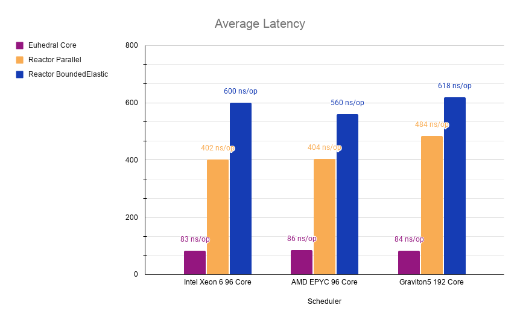
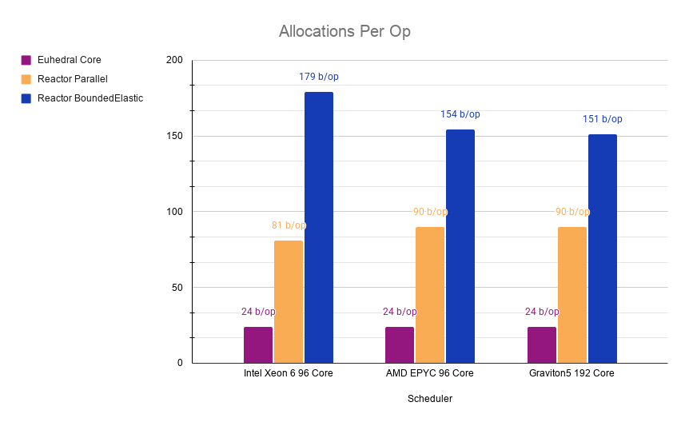

# High Scale Benchmarks in Amazon ECS

| Config           | Instance 1                    | Instance 2         | Instance 3      |
|:-----------------|:------------------------------|--------------------|-----------------|
| Instance         | AWS c8i.metal-48xl            | AWS c8a.metal-24xl | AWS c9g.8xlarge |
| Operating System | Amazon Linux                  | Amazon Linux       | Amazon Linux    |
| Processor        | Intel Xeon 6 (Granite Rapids) | AMD EPYC 9R45      | AWS Graviton5   |
| Architecture     | x86_64                        | x86_64             | arm64           |
| vCPUs            | 192                           | 96                 | 192             |
| Physical Cores   | 96                            | 96                 | 192             |

#### VM Flags

```
-XX:+UseThreadPriorities
--enable-native-access=ALL-UNNAMED
--sun-misc-unsafe-memory-access=allow
--add-exports java.base/jdk.internal.platform=ALL-UNNAMED
--add-exports java.base/jdk.internal.vm.annotation=ALL-UNNAMED
--add-opens java.base/java.util=ALL-UNNAMED
```

Work items were pre-allocated for all benchmarks to only measure scheduling overhead.

JMH was used for all benchmarking.

---

# Mandelbrot

These tests are missing perf counters due to the limitations of the EC2 virtualized environment.
While I wait on a quota increase for access to the bare-metal servers, these are the shallow results
from the tests.

With SMT enabled, Euhedral delegates the pulling of work to its hyper thread sibling.
With SMT disabled, Euhedral only places one thread on the core. 16 out of 32 possible threads.

---

### Disclaimer

Feeding the Reactor schedulers the exact same way as Euhedral does not make them fully utilize the
available cores automatically.

Ideally, they would be fed like this:

```java
Flux.fromArray(this.pixels)
    .parallel()
    .runOn(Schedulers.parallel())
    .subscribe(this.subscriber);

Flux.fromArray(this.pixels)
    .parallel()
    .runOn(Schedulers.boundedElastic())
    .subscribe(this.subscriber);

// Euhedral Core
Flux.fromArray(this.pixels).subscribe(this.subscriber);
this.controlPlane.ingest(this.subscriber);
```

Using `.parallel()` lead to higher allocations, significantly lower throughput, and latencies
exceeding 2 microseconds per operation.

To have a fairer comparison, Reactor needs to be forced into using all cores with flatMap and their
native tasking constructs (Mono). To avoid extra allocations for Reactor, the Mono objects were also
pre-allocated.

How Reactor was fed the tasks:

```java
Flux.fromArray(this.monos)
    .flatMap(m ->m.subscribeOn(Schedulers.parallel()), Runtime.getRuntime().availableProcessors())
    .subscribe(this.subscriber);
```

---

### Results




| CPU                                             | Scheduler              |   ns/op | Alloc mb/sec | bytes/op | GC Counts | GC Time |
|-------------------------------------------------|:-----------------------|--------:|-------------:|---------:|----------:|--------:|
| $$\color{#0068B5}{\textsf{Intel\ Xeon\ 6}}$$    | Euhedral Core          |  82.838 |      270.985 |   24.049 |         1 |      24 |
| $$\color{#0068B5}{\textsf{Intel\ Xeon\ 6}}$$    | Reactor Parallel       | 401.638 |      192.680 |   81.148 |         5 |      42 |
| $$\color{#0068B5}{\textsf{Intel\ Xeon\ 6}}$$    | Reactor BoundedElastic | 600.406 |      284.855 |  179.338 |         5 |      55 |
| $$\color{#ED1C24}{\boxed{\textsf{AMD\ EPYC}}}$$ | Euhedral Core          |  86.208 |      261.732 |   24.030 |         2 |      49 |
| $$\color{#ED1C24}{\boxed{\textsf{AMD\ EPYC}}}$$ | Reactor Parallel       | 403.559 |      212.683 |   90.000 |        10 |      20 |
| $$\color{#ED1C24}{\boxed{\textsf{AMD\ EPYC}}}$$ | Reactor BoundedElastic | 559.905 |      262.778 |  154.279 |         5 |       8 |
| $$\color{#FF9900}{\boxed{\textsf{Graviton5}}}$$ | Euhedral Core          |  83.792 |      268.057 |   24.057 |        14 |      64 |
| $$\color{#FF9900}{\boxed{\textsf{Graviton5}}}$$ | Reactor Parallel       | 483.897 |      177.372 |       90 |         5 |      31 |
| $$\color{#FF9900}{\boxed{\textsf{Graviton5}}}$$ | Reactor BoundedElastic | 618.313 |      233.101 |  151.132 |         8 |      59 |

---

#### Perf Counter Comparison

| CPU                                             | Scheduler              |  IPC | L1 D-Cache Miss | L1 I-Cache Miss | dTLB Miss | iTLB Miss % | Branch Miss % |
|-------------------------------------------------|:-----------------------|-----:|----------------:|----------------:|----------:|------------:|--------------:|
| $$\color{#0068B5}{\textsf{Intel\ Xeon\ 6}}$$    | Euhedral Core          | 2.93 |             N/A |             N/A |       N/A |         N/A |           N/A |
| $$\color{#0068B5}{\textsf{Intel\ Xeon\ 6}}$$    | Reactor Parallel       | 2.13 |             N/A |             N/A |       N/A |         N/A |           N/A |
| $$\color{#0068B5}{\textsf{Intel\ Xeon\ 6}}$$    | Reactor BoundedElastic | 2.25 |             N/A |             N/A |       N/A |         N/A |           N/A |
| $$\color{#ED1C24}{\boxed{\textsf{AMD\ EPYC}}}$$ | Euhedral Core          | 2.89 |           0.05% |           6.87% |    57.08% |       3.56% |     0.000101% |
| $$\color{#ED1C24}{\boxed{\textsf{AMD\ EPYC}}}$$ | Reactor Parallel       | 2.44 |           0.41% |          12.95% |    19.72% |       1.16% |     0.000567% |
| $$\color{#ED1C24}{\boxed{\textsf{AMD\ EPYC}}}$$ | Reactor BoundedElastic | 2.33 |           0.48% |           7.70% |    11.67% |       0.04% |     0.000588% |
| $$\color{#FF9900}{\boxed{\textsf{Graviton5}}}$$ | Euhedral Core          | 2.43 |           0.75% |           0.18% |     0.47% |       0.02% |     0.000304% |
| $$\color{#FF9900}{\boxed{\textsf{Graviton5}}}$$ | Reactor Parallel       | 2.68 |           0.42% |           0.38% |     0.26% |       0.05% |     0.000553% |
| $$\color{#FF9900}{\boxed{\textsf{Graviton5}}}$$ | Reactor BoundedElastic | 2.44 |           0.42% |           0.56% |     0.29% |       0.07% |     0.000323% |

---

#### CPU Time

| CPU                                             | Runtime                | Wall Clock Runtime | User Seconds | System Time |
|-------------------------------------------------|------------------------|-------------------:|-------------:|------------:|
| $$\color{#0068B5}{\textsf{Intel\ Xeon\ 6}}$$    | Euhedral Core          |             57.394 |     5579.035 |     141.775 |
| $$\color{#0068B5}{\textsf{Intel\ Xeon\ 6}}$$    | Reactor Parallel       |            104.231 |     2920.635 |     644.114 |
| $$\color{#0068B5}{\textsf{Intel\ Xeon\ 6}}$$    | Reactor BoundedElastic |            158.336 |     3228.513 |     380.155 |
| $$\color{#ED1C24}{\boxed{\textsf{AMD\ EPYC}}}$$ | Euhedral Core          |             53.618 |     5606.848 |      23.558 |
| $$\color{#ED1C24}{\boxed{\textsf{AMD\ EPYC}}}$$ | Reactor Parallel       |             95.132 |     2191.680 |     318.022 |
| $$\color{#ED1C24}{\boxed{\textsf{AMD\ EPYC}}}$$ | Reactor BoundedElastic |            140.763 |     2364.622 |     289.495 |
| $$\color{#FF9900}{\boxed{\textsf{Graviton5}}}$$ | Euhedral Core          |             58.610 |     8316.135 |     815.434 |
| $$\color{#FF9900}{\boxed{\textsf{Graviton5}}}$$ | Reactor Parallel       |            112.914 |     2753.357 |     291.640 |
| $$\color{#FF9900}{\boxed{\textsf{Graviton5}}}$$ | Reactor BoundedElastic |            152.547 |     3015.122 |     309.997 |

---

#### Raw Hardware Counters

| CPU                                             | Scheduler              |             Cycles |       Instructions |   Cache Misses |       Branch Loads | Branch Misses |
|:------------------------------------------------|:-----------------------|-------------------:|-------------------:|---------------:|-------------------:|--------------:|
| $$\color{#0068B5}{\textsf{Intel\ Xeon\ 6}}$$    | Euhedral Core          | 20,625,266,011,737 | 60,353,132,304,660 |  4,148,144,539 |                N/A |   823,916,196 |
| $$\color{#0068B5}{\textsf{Intel\ Xeon\ 6}}$$    | Reactor Parallel       | 11,326,830,843,340 | 24,128,366,443,003 | 30,766,280,575 |                N/A | 6,140,131,887 |
| $$\color{#0068B5}{\textsf{Intel\ Xeon\ 6}}$$    | Reactor BoudnedElastic | 1,108,7824,431,848 | 24,945,324,094,678 | 13,451,026,332 |                N/A | 1,847,667,259 |
| $$\color{#ED1C24}{\boxed{\textsf{AMD\ EPYC}}}$$ | Euhedral Core          | 18,829,091,755,720 | 54,343,556,258,338 |  2,600,888,370 |  9,984,062,395,403 | 1,012,646,708 |
| $$\color{#ED1C24}{\boxed{\textsf{AMD\ EPYC}}}$$ | Reactor Parallel       |  9,484,597,705,145 | 23,109,727,897,133 |  7,753,919,138 |  4,257,709,312,958 | 2,425,579,777 |
| $$\color{#ED1C24}{\boxed{\textsf{AMD\ EPYC}}}$$ | Reactor BoundedElastic | 10,302,281,428,853 | 23,956,975,516,816 |  8,230,497,977 |  4,408,035,293,741 | 2,590,251,618 |
| $$\color{#FF9900}{\boxed{\textsf{Graviton5}}}$$ | Euhedral Core          | 27,429,847,872,535 | 66,649,183,214,364 | 81,970,475,585 | 12,648,339,885,278 | 3,840,342,402 |
| $$\color{#FF9900}{\boxed{\textsf{Graviton5}}}$$ | Reactor Parallel       |  8,518,881,468,865 | 22,840,422,013,665 | 13,402,537,594 |  4,282,035,677,859 | 2,369,065,003 |
| $$\color{#FF9900}{\boxed{\textsf{Graviton5}}}$$ | Reactor BoundedElastic |  9,669,934,328,418 | 23,571,013,534,443 | 14,458,504,329 |  4,433,174,053,585 | 1,430,985,887 |
