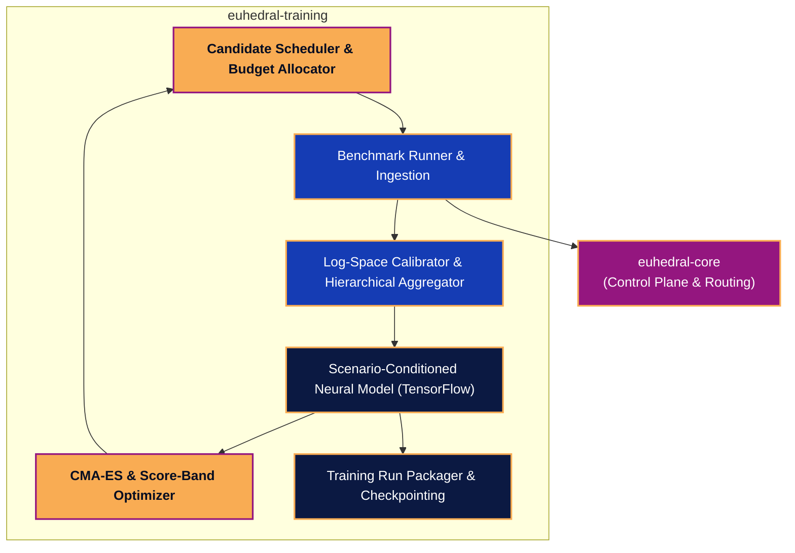
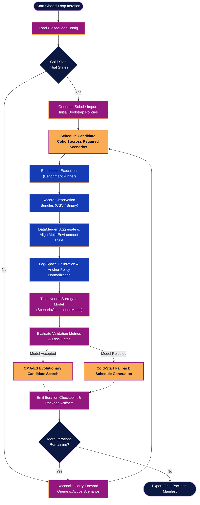
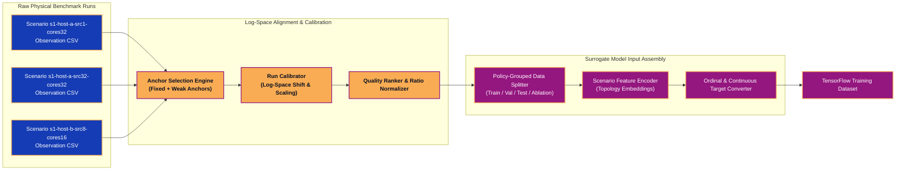
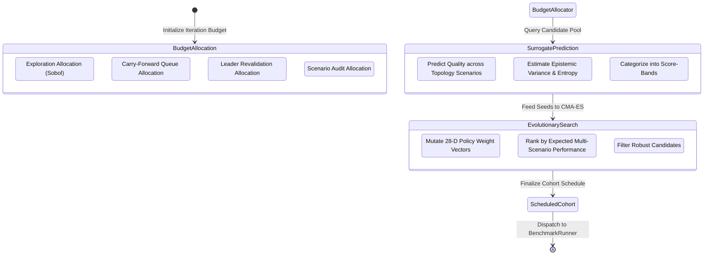
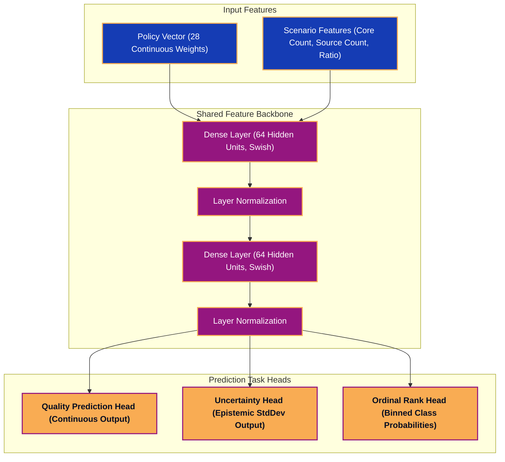

# Euhedral Training Architecture & Component Diagrams

This document maps out the component architecture, execution pipeline, calibration flow, candidate optimization loop, and model training workflow for the `euhedral-training` subsystem and its integration with the core Euhedral engine.

---

## 1. System Module Topology & Component Boundaries

The overall dependency graph between lower-level core components and higher-level training pipelines.

---

## 2. Closed-Loop Optimization Pipeline

The complete iteration workflow managed by `ClosedLoopRunner` across scheduling, native execution, log-space calibration, neural surrogate training, candidate search, and checkpoint packaging.

---

## 3. Data Calibration & Multi-Environment Aggregation

How observation bundles from distinct machine topology scenarios are merged, aligned in log-space, and converted into normalized training targets.

---

## 4. Candidate Generation & CMA-ES Evolutionary Loop

The inner optimization loop that uses the surrogate model to search for candidate runtime policy vectors.

---

## 5. Neural Surrogate Model Architecture

The multi-head TensorFlow architecture mapping 28 policy weights + scenario topology features to predicted performance distributions.

